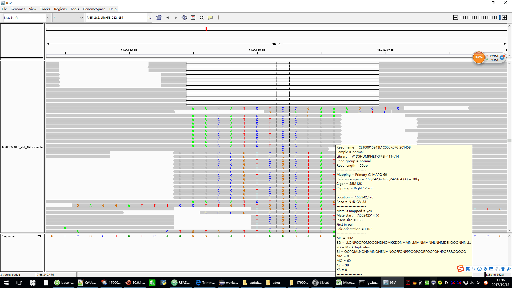
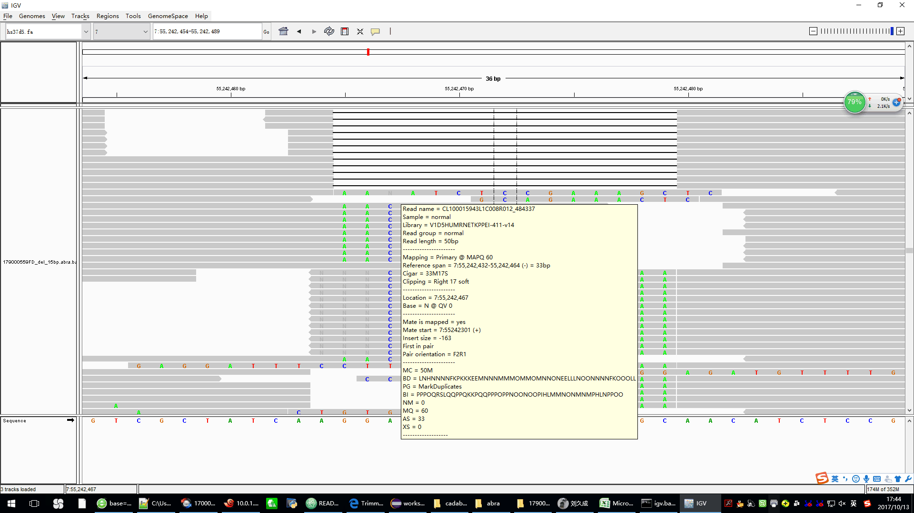
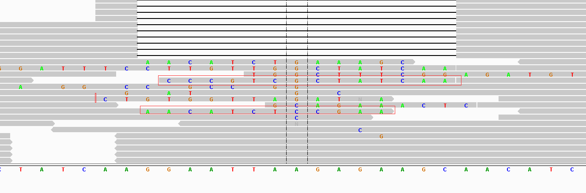

# ABRA2

ABRA2 is an updated implementation of [ABRA](https://github.com/mozack/abra) featuring:
* RNA support
* Improved scalability (Human whole genomes now supported)
* Improved accuracy
* Improved stability and usability (BWA is no longer required to run ABRA although we do recommend BWA as the initial aligner for DNA)

## Running

ABRA2 requires Java 8.

## Arguments
|  option|description|default value|
|---|---|-----|
| --in|Required list of input sam or bam file(s) separated by comma|-|
| --out|Required list of output sam or bam file(s) separated by comma|-|
| --ref|Genome reference location|-|
| --targets|BED file containing target regions|-|
| --target-kmers|BED-like file containing target regions with per region kmer sizes in 4th column|-|
| --kmer|Optional assembly kmer size(delimit with commas if multiple sizes specified)|-|
| --mnf|Assembly minimum node frequency|1|
| --mcl|Assembly minimum contig length|-1|
| --threads|Number of threads|4|
| --single|Input is single end|-|
| --mapq|Minimum mapping quality for a read to be used in assembly and be eligible for realignment|20|
| --rcf|Minimum read candidate fraction for triggering assembly|0.01|
| --mad|Regions with average depth exceeding this value will be downsampled|1000|
| --mer|Min edge pruning ratio.  Default value is appropriate for relatively sensitive somatic cases.  May be increased for improved speed in germline only cases.|0.01|
| --maxn|Maximum pre-pruned nodes in regional assembly|150000|
| --sa|Skip assembly|-|
| --ssc|Skip usage of soft clipped sequences as putative contigs|-|
| --sc|Soft clip contig args [max_contigs,min_base_qual,frac_high_qual_bases,min_soft_clip_len]|16,13,80,15|
| --sobs|Do not use observed indels in original alignments to generate contigs|-|
| --junctions|Splice junctions definition file|-|
| --log|Logging level (trace,debug,info,warn,error)|info|
| --contigs|Optional file to which assembled contigs are written|-|
| --gtf|GTF file defining exons and transcripts|-|
| --sga|Scoring used for contig alignments (match, mismatch_penalty, gap_open_penalty, gap_extend_penalty)|8,32,48,1|
| --mcr|Max number of cached reads per sample per thread|1000000|
| --keep-tmp|Do not delete the temporary directory|-|
| --tmpdir|Set the temp directory (overrides java.io.tmpdir)|-|
| --cons|Use positional consensus sequence when aligning high quality soft clipping|-|
| --mmr|Max allowed mismatch rate when mapping reads back to contigs|0|
| --ws|Processing window size and overlap (size,overlap)|400,200|
| --mrr|Regions containing more reads than this value are not processed.  Use -1 to disable.|1000000|
| --cl|Compression level of output bam file(s)|5|
| --ca|Contig anchor [M_bases_at_contig_edge, max_mismatches_near_edge]|10,2|
| --nosort|Do not attempt to sort final output|-|
| --dist|Max read move distance|1000|
| --skip|If no target specified, skip realignment of chromosomes matching specified regex.  Skipped reads are output without modification.  Specify none to disable.|GL.\* hs37d5 chr.\*random chrUn.\*  chrEBV CMV HBV HCV.\* HIV.\* KSHV HTLV.\* MCV SV40 HPV.\*|
| --mac|Max assembled contigs|64|
| --sua|Do not use unmapped reads anchored by mate to trigger assembly.  These reads are still eligible to contribute to assembly|-|
| --undup|Unset duplicate flag|-|
| --in-vcf|VCF containing known (or suspected) variant sites.  Very large files should be avoided.|-|
| --index|Enable BAM index generation when outputting sorted alignments (may require additonal memory)|-|
| --gkl|If specified, use GKL Intel Deflater (experimental)|-|
| --amq|Set mapq for alignments that map equally well to reference and an ABRA generated contig.  default of -1 disables|-1|
| --mrn|Reads with noise score exceeding this value are not remapped.  numMismatches+(numIndels*2) < readLength*mnr|.10|
| --msr|Max reads to keep in memory per sample during the sort phase.  When this value is exceeded, sort spills to disk|1000000|


### DNA

Sample command for DNA:

```java -Xmx16G -jar abra2.jar --in normal.bam,tumor.bam --out normal.abra.bam,tumor.abra.bam --ref hg38.fa --threads 8 --targets targets.bed --dist 1000 --tmpdir /your/tmpdir > abra.log```

The above accepts normal.bam and tumor.bam as input and outputs sorted realigned BAM files named normal.abra.bam and tumor.abra.bam

* Input files must be sorted by coordinate and index
* Output files are sorted
* The tmpdir may grow large.  Be sure you have sufficient space there (at least equal to the input file size)
* The targets argument is not required.  When omitted, the entire genome will be eligible for realignment.

### The result
*  the picture is the original bam,we can see many reads have softclip in the end   

*     
<hr>
*  the picture is the abra2 processed bam,we can see some reads have softclip in the end,these reads contains N in the end    

*      
<hr>
*  the picture is the abra2_modified processed bam,we can see only a few reads have softclip in the end,these reads and their mate reads are not mapped in the same chromosome   

*     
### RNA

Abra2 is capable of utilizing junction information to aid in assembly and realignment.  It has been tested only on STAR output to date.

Sample command for RNA:

```java -Xmx16G -jar abra2.jar --in star.bam --out star.abra.bam --ref hg38.fa --junctions SJ.out.tab --threads 8 --gtf gencode.v26.annotation.gtf --dist 500000 --tmpdir /your/tmpdir  > abra2.log 2>&1```

Here, star.bam is the input bam file and star.abra.bam is the output bam file.

Junctions observed during alignment can be passed in using the ```--junctions``` param.  This corresponds to the SJ.out.tab file output by STAR.

Annotated junctions can be passed in using the ```--gtf``` param.  See: https://www.gencodegenes.org/releases/current.html  
It is beneficial to use both of the junction related options.

The software is currently considered beta quality.
